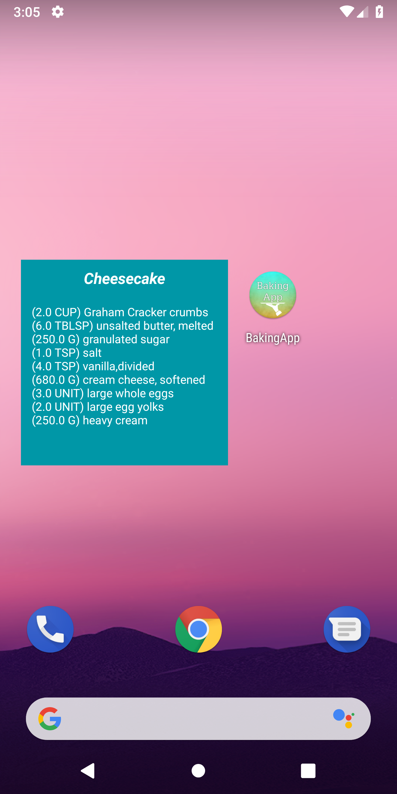
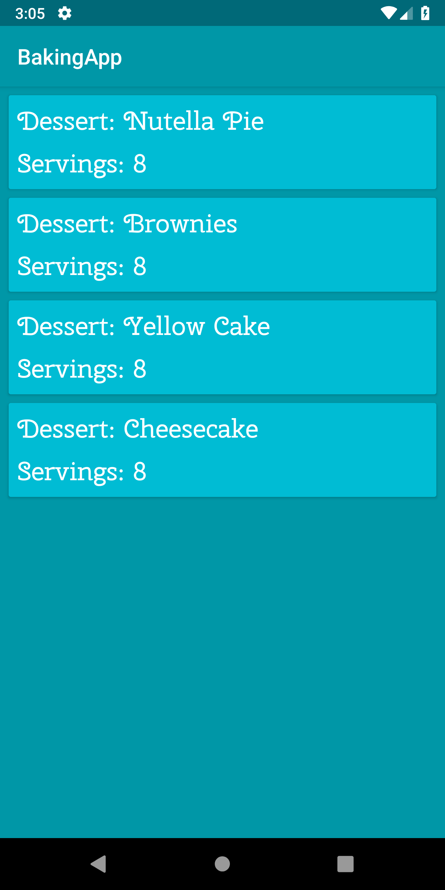
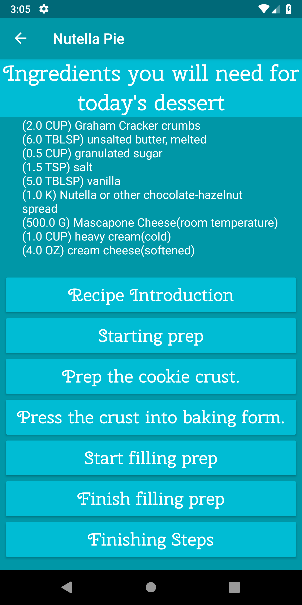
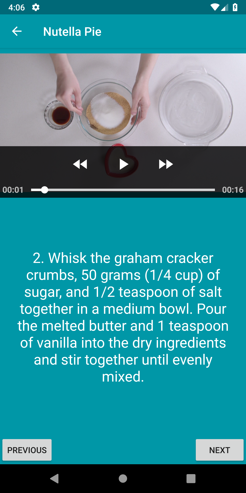
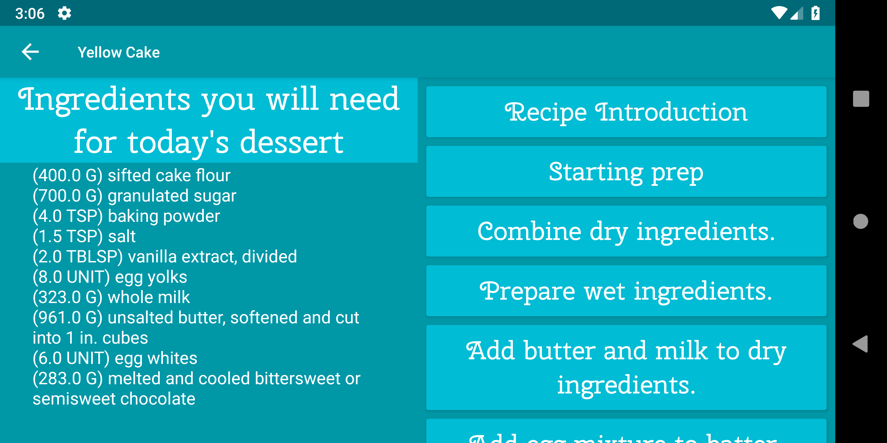
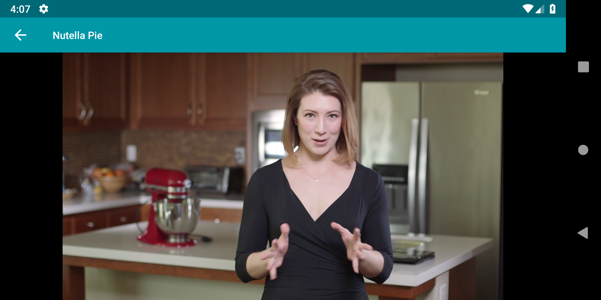
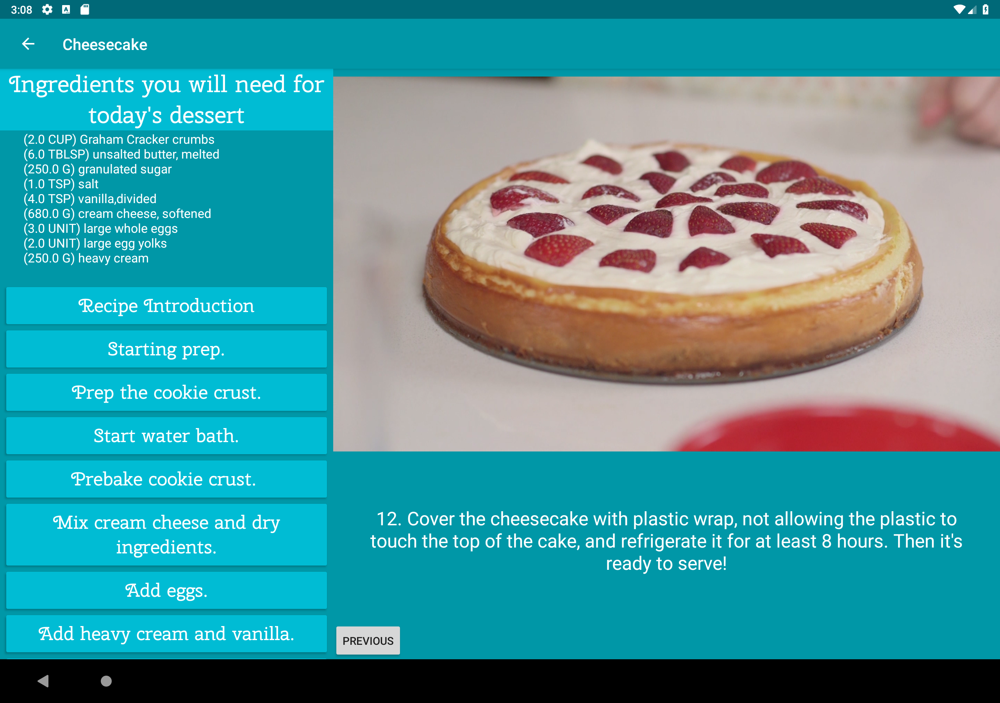

# BakingApp
Baking App complete for Udacity Android Developer Nanodegree.

  

Complete with a custom icon and it's own widget.

   

You can choose a recipe and learn how to make it with all necessary ingredients, instructions for each step, and videos to follow.

Designed to work in different orientations and devices such as tablets efficiently.

## Used Libraries
* [Retrofit 2](https://github.com/square/retrofit) with [Gson converter](https://github.com/square/retrofit/tree/master/retrofit-converters/gson)
* [ButterKnife](https://github.com/JakeWharton/butterknife)
* [ExoPlayer](https://github.com/google/ExoPlayer)

## Project Overview
You will productionize an app, taking it from a functional state to a production-ready state. This will involve finding and handling error cases, adding accessibility features, allowing for localization, adding a widget, and adding a library.

## Why this Project?
As a working Android developer, you often have to create and implement apps where you are responsible for designing and planning the steps you need to take to create a production-ready app. Unlike Popular Movies where we gave you an implementation guide, it will be up to you to figure things out for the Baking App.

## What Will I Learn?
In this project you will:
* Use MediaPlayer/Exoplayer to display videos.
* Handle error cases in Android.
* Add a widget to your app experience.
* Leverage a third-party library in your app.
* Use Fragments to create a responsive design that works on phones and tablets.

## Rubric

### General App Usage
- [x] App should display recipes from provided network resource.
- [x] App should allow navigation between individual recipes and recipe steps.
- [x] App uses RecyclerView and can handle recipe steps that include videos or images.
- [x] App conforms to common standards found in the Android Nanodegree General Project Guidelines.

### Components and Libraries
- [x] Application uses Master Detail Flow to display recipe steps and navigation between them.
- [x] Application uses Exoplayer to display videos.
- [x] Application properly initializes and releases video assets when appropriate.
- [x] Application should properly retrieve media assets from the provided network links. It should properly handle network requests.
- [x] Application makes use of Espresso to test aspects of the UI.
- [x] Application sensibly utilizes a third-party library to enhance the app's features. That could be helper library to interface with Content Providers if you choose to store the recipes, a UI binding library to avoid writing findViewById a bunch of times, or something similar.

### Homescreen Widget
- [x] Application has a companion homescreen widget.
- [x] Widget displays ingredient list for desired recipe.
